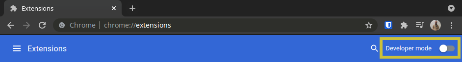
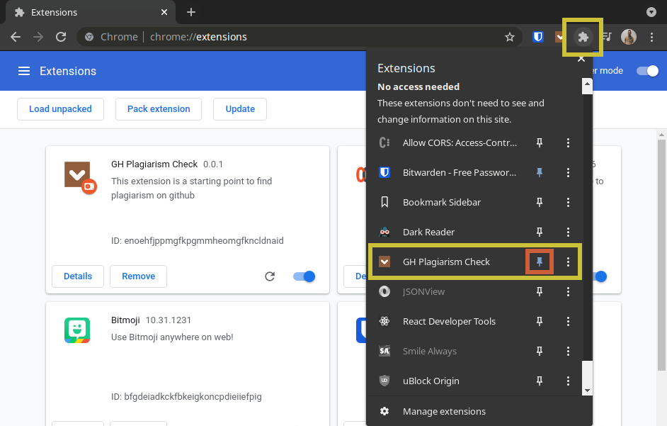

# Gh Plagiarism Check

Searching for plagiarism on github can be a bit tidious. Github avoids very specific characters on all of its queries so if you search for something that contains any of those characters, odds are your search will come out empty handed. After spending minutes removing these characters manually time and time again, I came to the realization that it would be much easier if all I had to do was copy, paste, and hit a button. This is how Gh Plagiarism Check came to be. This extension is very light and easy to use. It keeps track of your last 10 searches made by taking in short or long queries, removing anything that github deems unvalueable for searches and creates a new more precise query which opens up automatically in a new tab under github code search. Couldn't get easier than that!
<br>


## Table of Contents

- [Installation](#installation)

- [Beta Features](#beta-features)

- [Updating](#updating)

- [Uninstall](#uninstall)

- [Example Query In](#example-query-in)

- [Example URL Out](#example-url-out)

- [Questions](#questions)

# Installation

## Method 1: Chrome Web Store (Recommended)

This extension can be found on and installed through the [`Chrome Web Store`](https://chrome.google.com/webstore/detail/gh-plagiarism-check/fbnkdiommanmaggjbppgecgpekigaceb?hl=en&authuser=2). This is the recommended method of installation unless you want to try [`beta features`](#beta-features) before they are released. For regular manual install, proceed to the [`Manual Install`](#method-2-manual-install) section

<br>

## Method 2: Manual Install

If you would like to install manually and get features faster, you can follow the instructions below. Please keep in mind that manual installation will not automatically install any updates, those will have to be installed using the instructions found [`below`](#updating). This is also a different branch from the one holding the beta features. If you're looking for beta features, please install the manual install instructions and after this, follow the instructions found in the [`beta`](#beta-features) section

1. Navigate to the Chrome Extensions Page [(`chrome://extensions/`)](chrome://extensions/) and hit the "Developer mode" toggle on the top right


<br>
<br>

2. To download the chrome extension manually, open a terminal and use the following bash command:

   ` Windows:`

   ```
   cd ~ && git clone https://github.com/teamjuli0/gh-plagiarism.git && cd ~/gh-plagiarism && npm run install && explorer .
   ```

   `Mac:`

   ```
   cd ~ && git clone https://github.com/teamjuli0/gh-plagiarism.git && cd ~/gh-plagiarism && npm run install && open .
   ```

   `Linux:`

   ```
   cd ~ &&  git clone https://github.com/teamjuli0/gh-plagiarism.git && cd ~/gh-plagiarism && npm run install && xdg-open .
   ```

3) After download finishes and with the Chrome Extensions tab open, drag the `build` folder into the Chrome Extensions tab on the browser.
4) For ease-of-use, I recommend clicking on the puzzle piece on the top right, finding the "Gh Plagiarism Check" extension, and clicking the pin to pin it with your favorite extensions.


<br>
<br>

## Beta Features

For Beta Features, please run the following command after [`installation`](#method-2-manual-install). Updates will be installed the same way as the non-beta install:

```
cd ~/gh-plagiarism && npm run install-dev
```

## Updating

If you installed the extension manually, you can update to the latest version by using the following command:

```
cd ~/gh-plagiarism && npm run update
```

## Uninstall

Uninstalling this extension can be done with 2 easy steps

1. Remove the chrome extension just as you would with any other extension

2. Run the following command to remove all of the extension files from your computer

   Windows:

   ```
   cd ~/ && rm -r ./gh-plagiarism
   ```

   Mac or Linux:

   ```
   cd ~/ && sudo rm -r ./gh-plagiarism
   ```

## Example Query In

```javascript
function asyncCopyTo(from, to) {
  return asyncMkDirP(path.dirname(to)).then(
    () =>
      new Promise((resolve, reject) => {
        ncp(from, to, (error) => {
          if (error) {
            // Wrap to have a useful stack trace.
            reject(new Error(error))
          } else {
            // Wait for copied files to exist; ncp() sometimes completes prematurely.
            // For more detail, see github.com/facebook/react/issues/22323
            // Also github.com/AvianFlu/ncp/issues/127
            setTimeout(resolve, 10)
          }
        })
      })
  )
}
```

## Example URL Out

Gh Plagiarism Check: [1 Result (as of writing)](https://github.com/search?q=function+asyncCopyTo+from+to+return+asyncMkDirP+path+dirname+to+then+new+Promise+resolve+reject+ncp+from+to+error+if+error+Wrap+to+have+a+useful+stack+trace+reject+new+Error+error+else+Wait+for+copied+files+to+exist+ncp+sometimes+completes+prematurely+For+more+detail+see+github+com+facebook+react+issues+22323+Also+github+com+AvianFlu+ncp+issues+127+setTimeout+resolve+10&type=code)

Github Search: [0 Results (as of writing)](https://github.com/search?q=function+asyncCopyTo%28from%2C+to%29+%7B+++return+asyncMkDirP%28path.dirname%28to%29%29.then%28+++++%28%29+%3D%3E+++++++new+Promise%28%28resolve%2C+reject%29+%3D%3E+%7B+++++++++ncp%28from%2C+to%2C+error+%3D%3E+%7B+++++++++++if+%28error%29+%7B+++++++++++++%2F%2F+Wrap+to+have+a+useful+stack+trace.+++++++++++++reject%28new+Error%28error%29%29%3B+++++++++++%7D+else+%7B+++++++++++++%2F%2F+Wait+for+copied+files+to+exist%3B+ncp%28%29+sometimes+completes+prematurely.+++++++++++++%2F%2F+For+more+detail%2C+see+github.com%2Ffacebook%2Freact%2Fissues%2F22323+++++++++++++%2F%2F+Also+github.com%2FAvianFlu%2Fncp%2Fissues%2F127+++++++++++++setTimeout%28resolve%2C+10%29%3B+++++++++++%7D+++++++++%7D%29%3B+++++++%7D%29+++%29%3B+%7D&type=code)

## License

This project is licensed under the [MIT license](./license.txt).

## Questions

Feel free to open an issue or contact me directly at valdezjulio95@gmail.com if you have any questions about the repo. You can find more of my work at [teamjuli0](https://github.com/teamjuli0/).
