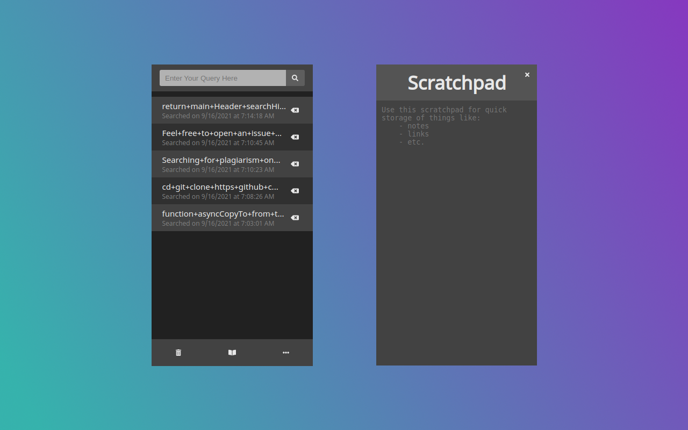

  

<h3 align="center">Gh Plagiarism Check</h3>

---

 Confirming code snippets has never been easier!
      

## 

- [About](#about)
- [Installing](#installing)
- [Usage](#usage)
- [Built With](#built_using)
- [Authors](#authors)
- [Example URL Out](#example-url-out)
- [Questions](#questions)
- [Screenshots](#screenshots)

## 

Searching for plagiarism on github can be a bit tidious. Github avoids very specific characters on all of its queries so if you search for something that contains any of those characters, odds are your search will come out empty handed. After spending minutes removing these characters manually time and time again, I came to the realization that it would be much easier if all I had to do was copy, paste, and hit a button. This is how Gh Plagiarism Check came to be. This extension is very light and easy to use. It keeps track of your last 10 searches made by taking in short or long queries, removing anything that github deems unvalueable for searches and creates a new more precise query which opens up automatically in a new tab under github code search. Couldn't get easier than that!

## 

This extension can be found on and installed through the [`Chrome Web Store`](https://chrome.google.com/webstore/detail/gh-plagiarism-check/fbnkdiommanmaggjbppgecgpekigaceb?hl=en&authuser=2). For beta features or to get this project running locally, please refer to the manual install documentation of the [`Wiki`](https://github.com/teamjuli0/gh-plagiarism/wiki/Local-Installation).

## 

1. Enter search query into input on the top of the extension and hit enter/search button. This will redirect you back to github searches with a search query that more closely matches github's search criteria.
2. To remove an item from your search history, hit the "backspace" icon on the right of that history item.
3. To remove all search items at the same time, hit the trashbin on the bottom left of the footer and confirm on the popup.
4. To jot down quick notes on the scratchpad, click on the book icon in the center of the footer.
5. You can easily export your data or view it raw on a new tab inside of the settings tab. Here you can also set the maximum length for your search history if you wanted to change it from the default.

## 

- Chrome Extension
- React.js
- Javascript

## 

- [@teamjuli0](https://github.com/teamjuli0) - Idea & Initial work
- See also the list of [contributors](https://github.com/kylelobo/The-Documentation-Compendium/contributors) who participated in this project.

## 

- Feel free to open an issue or contact me directly at valdezjulio95@gmail.com if you have any questions about the repo. You can find more of my work at [teamjuli0](https://github.com/teamjuli0/).

## 

</a>
