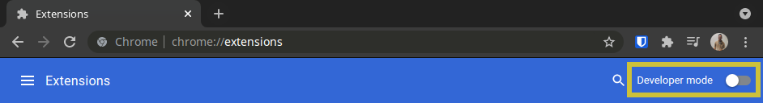
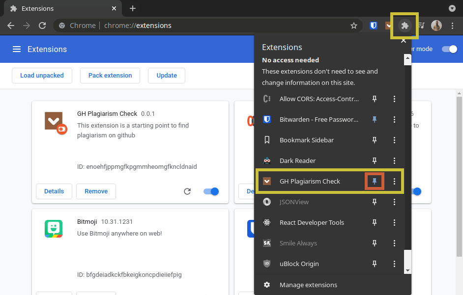

# Gh Plagiarism Check

Searching for plagiarism on github can be a bit tidious. Github avoids very specific characters on all of its queries so if you search for something that contains any of those characters, odds are your search will come out empty handed. After spending minutes removing these characters manually time and time again, I came to the realization that it would be much easier if all I had to do was copy, paste, and hit a button. This is how Gh Plagiarism Check came to be. This extension is very light and easy to use. It keeps track of your last 10 searches made by taking in short or long queries, removing anything that github deems unvalueable for searches and creates a new more precise query which opens up automatically in a new tab under github code search. Couldn't get easier than that!
<br>


## Table of Contents

- [Installation](#installation)

- [Example Query In](#example-query-in)

- [Example URL Out](#example-url-out)

- [Questions](#questions)

# Installation

## Method 1: Chrome Web Store

Navigate to the Chrome Web Store and install extension from there (link coming soon)

<br>

## Method 2: Manual Install Through Developer Mode

1. Navigate to the [Chrome Extensions Page](chrome://extensions/) and hit the "Developer mode" toggle on the top right


<br>
<br>

2. To download the chrome extension manually, open a terminal and use the following bash command:

   ` Windows:`

   ```
   cd ~ && git clone https://github.com/teamjuli0/gh-plagiarism.git && cd ~/gh-plagiarism && npm run dev-install && explorer .
   ```

   `Mac:`

   ```
   cd ~ && git clone https://github.com/teamjuli0/gh-plagiarism.git && cd ~/gh-plagiarism && npm run dev-install && open .
   ```

   `Linux:`

   ```
   cd ~ &&  git clone https://github.com/teamjuli0/gh-plagiarism.git && cd ~/gh-plagiarism && npm run dev-install && xdg-open .
   ```

3) After download finishes and with the `Chrome Extensions` tab open, just drag the `develop` folder into the chrome browser.
4) For ease-of-use, I recommend clicking on the cog on the top right, finding the "Gh Plagiarism Check" extension, and clicking the pin to pin it with your favorite extensions.


<br>
<br>

## Example Query In

```javascript
const [searchHistory, setSearchHistory] = useState(
  JSON.parse(localStorage.getItem('ghPlagiarismHistory')) || []
)

useEffect(() => {
  localStorage.setItem('ghPlagiarismHistory', JSON.stringify(searchHistory))
}, [searchHistory])

const inputEl = useRef()

function clearStorage() {
  localStorage.setItem('ghPlagiarismHistory', '[]')
  setSearchHistory([])
}

function handleKeyUp(e, str) {
  if (e.keyCode === 13) {
    checkStr(str)
  }
}
```

## Example URL Out

Gh Plagiarism Check: [1 Result(s)](https://github.com/search?q=const+searchHistory+setSearchHistory+useState+JSON+parse+localStorage+getItem+ghPlagiarismHistory+useEffect+localStorage+setItem+ghPlagiarismHistory+JSON+stringify+searchHistory+searchHistory+const+inputEl+useRef+function+clearStorage+localStorage+setItem+ghPlagiarismHistory+setSearchHistory+function+handleKeyUp+e+str+if+e+keyCode+13+checkStr+str&type=code)

Github Search: [0 Result(s)](https://github.com/search?q=https%3A%2F%2Fgithub.com%2Fsearch%3Fq%3Dconst%2BsearchHistory%2BsetSearchHistory%2BuseState%2BJSON%2Bparse%2BlocalStorage%2BgetItem%2BghPlagiarismHistory%2BuseEffect%2BlocalStorage%2BsetItem%2BghPlagiarismHistory%2BJSON%2Bstringify%2BsearchHistory%2BsearchHistory%2Bconst%2BinputEl%2BuseRef%2Bfunction%2BclearStorage%2BlocalStorage%2BsetItem%2BghPlagiarismHistory%2BsetSearchHistory%2Bfunction%2BhandleKeyUp%2Be%2Bstr%2Bif%2Be%2BkeyCode%2B13%2BcheckStr%2Bstr%26type%3Dcode&type=code)

## License

This project is licensed under the [MIT license](./license.txt).

## Questions

Feel free to open an issue or contact me directly at valdezjulio95@gmail.com if you have any questions about the repo. You can find more of my work at [teamjuli0](https://github.com/teamjuli0/).
